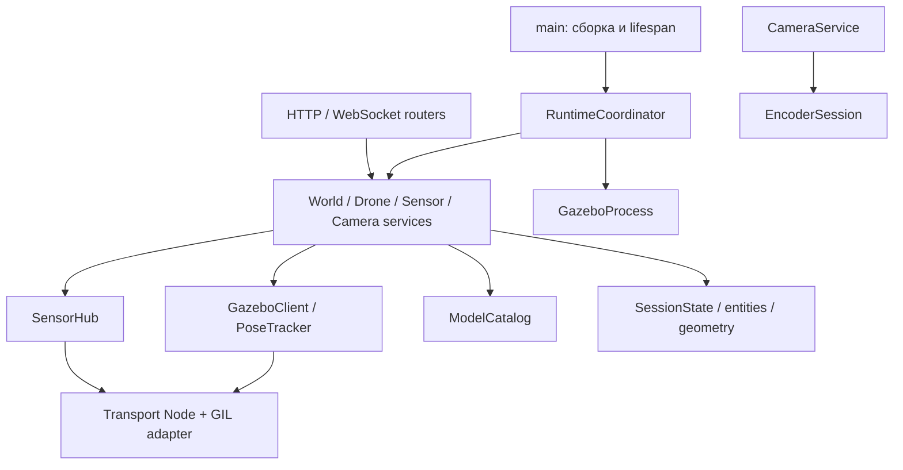

# План рефакторинга `app/main.py`

Статус: реализован; контейнерная проверка пройдена 2026-10-02. `main.py` сокращён до app factory/lifespan, глобальный `sim` удалён. Разделены Settings, схемы и entity state, routers, четыре доменных сервиса, SensorHub, EncoderSession, GazeboClient, GazeboProcess, PoseTracker и ModelCatalog.

Проверка в Docker: 15 unit-тестов, `regression.py`, `smoke.py`, `docker compose config --quiet`. Оставшиеся сценарии расширенного media/stream fault coverage перечислены в README и не менялись переносом модулей.

## Цель и границы

До рефакторинга `main.py` содержал около 1300 строк: конфигурацию из environment, Pydantic-схемы, реестры, управление процессами, Gazebo Transport, ожидание наблюдаемого состояния, жизненный цикл сенсоров, FFmpeg и HTTP/WebSocket-маршруты. Большая часть логики находится в `Simulator`, который владеет почти всеми ресурсами.

Цель — распределить ответственность и сделать владение ресурсами явным. Простого переноса класса `Simulator` в другой файл недостаточно: маршруты должны обращаться к сценариям управления, а сценарии — к публичному Gazebo-клиенту и владельцам подписок/процессов.

Рефакторинг сохраняет маршруты, статус-коды, JSON-ответы, семантику PATCH/reset, одну симуляцию и один HTTP worker. Изменение продукта — авторизация, новые изменяемые поля, атомарный PATCH, новый формат ответа или отдельный сервис видео — оформляется отдельной задачей. Новые слои базы данных, брокера и универсального DI-framework здесь не нужны.

## Предлагаемая структура

```text
app/
  main.py                    # create_app(), lifespan, сборка зависимостей
  config.py                  # Settings и чтение environment
  errors.py                  # ApiFault без зависимости от FastAPI
  geometry.py                # Vector3, Quaternion, Pose и сравнение поз
  entities.py                # DroneRecord, SensorRecord, SessionState
  catalog.py                 # Каталог моделей, исходный SDF и настройки сенсоров
  runtime.py                 # RuntimeCoordinator: start/reboot/shutdown
  api/
    dependencies.py          # Получение runtime/services из app.state
    schemas.py               # DroneCreate/Patch, WorldPatch, SensorPatch
    errors.py                # HTTP handlers ошибок и регистрации
    presenters.py            # Формирование существующих JSON-ответов
    server.py                # APIRouter: health/status/reboot
    world.py                 # APIRouter: мир
    drones.py                # APIRouter: дроны
    sensors.py               # APIRouter: сенсоры, WebSocket и камеры
  gazebo/
    client.py                # Публичные запросы/команды и protobuf-конвертация
    process.py               # Запуск и остановка принадлежащей группы процессов
    poses.py                 # PoseTracker: подписка, кеш, sequence, подтверждение
    state.py                 # Декодирование Transport component state
    transport.py             # Текущий transport.py, адаптер GIL
  services/
    world.py                 # WorldService: чтение, pause/resume, PATCH
    drones.py                # DroneService: create/get/list/pose/reset/delete
    sensors.py               # SensorService: discovery, настройки, rate/reset
    subscriptions.py         # SensorHub: подписки, observers, очереди, epochs
  media/
    cameras.py               # CameraService: activate/deactivate и статус
    encoder.py               # FFmpeg-процесс, кадры, pixel format и stride
  native/
    transport_request.cc     # Существующий адаптер; ABI сохраняется
  models/
    test_quad/               # Существующие SDF-ресурсы, не Python-пакет
```

Не каждый файл требует отдельного публичного класса. `catalog.py` и `presenters.py` могут содержать небольшой класс и чистые функции. Разбиение выполняется по владению состоянием и ресурсами, а не по заданному количеству строк.

## Ответственность и зависимости

| Компонент | Что делает и чем владеет |
| --- | --- |
| `Settings` | Читает и валидирует environment при создании приложения; хранит пути, порты и таймауты. Не запускает процессы |
| `SessionState` | Хранит generation мира, реестр дронов и общий reentrant lock операций. Не владеет Node или subprocess |
| `GazeboProcess` | Владеет Popen Gazebo и его логом; запускает новую группу процессов, завершает её, ждёт выход и закрывает лог |
| `GazeboClient` | Владеет Transport Node; предоставляет типизированные публичные методы чтения/команд. Прячет `_types`, `_request`, имена endpoints и protobuf |
| `PoseTracker` | Владеет подпиской `pose/info`, Condition, кешем по entity-id и sequence. Читает текущую позу и подтверждает quaternion/position |
| `ModelCatalog` | Читает поставляемые модели и SDF, разрешает include и начальные частоты. Не создаёт Gazebo entity |
| `WorldService` | Читает живые компоненты и источники данных, объединяет PATCH с текущими значениями, подтверждает команды и восстанавливает паузу |
| `SensorHub` | Владеет Transport-подписками сенсоров, observers и очередями потребителей; управляет кешем, epoch и retired-состоянием |
| `SensorService` | Обнаруживает сенсоры, проверяет capabilities, изменяет/подтверждает частоту и сбрасывает настройки; использует Hub |
| `EncoderSession` | Владеет одним FFmpeg, ограниченной очередью кадров, writer thread и stop event. Подготавливает rawvideo и освобождает процесс/потоки |
| `CameraService` | Владеет реестром EncoderSession, связывает камеры с кадрами и MediaMTX; предоставляет activate/deactivate/status |
| `DroneService` | Создаёт и меняет дроны; координирует reset/delete с SensorService и CameraService. Сохранённый SDF находится в DroneRecord |
| `RuntimeCoordinator` | Собирает компоненты и координирует жизненный цикл целого мира: старт, готовность, reboot/reset/shutdown |
| `api/*` | Валидирует HTTP-ввод, вызывает публичный сценарий, формирует существующий ответ. WebSocket управляет только соединением и своим handle подписки |

Основное направление зависимостей:



`SensorService` использует реестр из SessionState и не импортирует DroneService. CameraService зависит от SensorService и Hub; SensorService не обращается обратно к CameraService. Добавление `active`/`stream_url` в ответы выполняется presenter с публичным статусом камеры. DroneService может обращаться к WorldService, SensorService и CameraService; обратных зависимостей нет.

Единственная точка сборки — `create_app()`. Компоненты создаются явно, через конструкторы. Только для заменяемых границ, прежде всего GazeboClient и запуска процессов/кодировщика, нужны небольшие интерфейсы или Protocol; интерфейс на каждый класс не требуется.

## Инварианты, которые необходимо сохранить

1. **Наблюдаемое состояние:** `scene/info` не становится источником текущих поз; экспорт SDF не становится источником runtime physics/gravity. Команда считается подтверждённой по действующему механизму наблюдения.
2. **PATCH позы:** не удаляет и не создаёт entity, проверяет position и quaternion, учитывает эквивалентность `q` и `-q`, сохраняет прежний режим паузы.
3. **Reset:** исходное описание проверяется до удаления; API-id сохраняется при drone-reset, Gazebo entity-id меняется. Ошибка пересоздания сообщает факт удаления.
4. **Поколения и epochs:** callbacks старого мира игнорируются; retired-запись сенсора не оживает; сообщения старого epoch не отправляются после sensor-reset.
5. **Подписки:** обычные WebSocket-клиенты разделяют Transport-подписку; slow client получает свежие данные. Камеры не сериализуют Image в JSON. Отключение одного потребителя не снимает подписку, нужную остальным.
6. **Ресурсы:** каждый Node/subscription, subprocess, thread и log имеет одного владельца и идемпотентное освобождение.
7. **Конкурентность:** reentrant lock сериализует операции и чтения, которые уже защищены в текущем коде. Callback не берёт этот lock, не вызывает HTTP и не выполняет блокирующий Transport-запрос.
8. **GIL:** запросы и unsubscribe проходят через нативный адаптер; перенос модулей не возвращает стандартный блокирующий binding.
9. **Event loop:** запросы Transport, ожидания readiness/частоты и операции процессов выполняются в threadpool. Очереди asyncio изменяются через принадлежащий им loop.
10. **Частичный отказ:** подтверждённые поля PATCH мира и неподтверждённые операции не смешиваются; рефакторинг не вводит скрытый rollback.

Порядок блокировок: общий lock операции → локальная защита сенсора/позы. Callback использует только локальную защиту; вызов observers и отправка в event loop выполняются после её освобождения. Отдельные lock для каждого нового сервиса на первом этапе не вводятся: это изменило бы существующий порядок конкурентных операций.

## Жизненный цикл ресурсов

### Старт мира

RuntimeCoordinator запускает GazeboProcess → GazeboClient ждёт готовности → PoseTracker подключает подписку → загружается исходная конфигурация и реестр → SensorService обнаруживает сенсоры. При ошибке освобождаются уже созданные ресурсы в обратном порядке.

### Drone-reset / delete

DroneService проверяет сохранённое описание → запоминает активные камеры → CameraService останавливает нужные EncoderSession → SensorService/Hub помечает прежние записи retired и закрывает их handles → GazeboClient удаляет и подтверждает отсутствие модели.

При reset затем создаётся новая модель из сохранённого SDF и начальной позы, обновляется entity-id, обнаруживаются новые сенсоры, ожидается их готовность и восстанавливаются ранее активные камеры. При delete запись дрона удаляется. Замена записей не подменяется очисткой полей старого объекта.

### Reboot / world-reset / shutdown

RuntimeCoordinator инвалидирует generation → останавливает все камеры → закрывает handles сенсоров и подписки → останавливает PoseTracker → завершает группу Gazebo и лог → очищает реестры и кеши. Для reboot/reset затем выполняет старт исходного мира. Обработчик WebSocket в `finally` освобождает собственный старый handle, а не ищет новую запись с тем же id.

## Этапы реализации

Каждый этап оформляется отдельным изменением, которое можно проверить и откатить. До следующего этапа проходят соответствующие контейнерные проверки.

### 1. Зафиксировать контракт и базовые проверки

Снять текущую OpenAPI-схему, набор маршрутов, статус-коды и существенные формы JSON-ответов. Базовый прогон: 13 unit-тестов, `regression.py`, `smoke.py`. Сохранить проверку PATCH без смены entity-id как обязательную.

Добавлять тесты только на затрагиваемые границы: например, идемпотентное закрытие владельца ресурса или отказ старого handle после смены поколения. Не создавать тест на каждый перенесённый метод.

### 2. Вынести конфигурацию, схемы и данные

Перенести environment в Settings, ApiFault в `errors.py`, геометрию в `geometry.py`, request-схемы в `api/schemas.py`, записи сущностей в `entities.py`, SDF/catalog helpers в `catalog.py`.

Передавать Settings явно; сохранить действующие значения по умолчанию и Compose environment. Импорт схем и геометрии не должен импортировать Gazebo bindings или запускать процесс. После переноса обновить импорты unit-тестов, не оставляя глобальную `sim` специально для них.

Проверки: unit-контракт, ошибка валидации, Compose config.

### 3. Отделить FastAPI от управления симуляцией

Разнести маршруты по APIRouter, вынести exception handlers и presenters. Ввести `create_app(settings, runtime_factory)`; зависимости получать из `request.app.state`/`websocket.app.state`.

На этом этапе RuntimeCoordinator может временно оборачивать ещё не разделённый Simulator. Его создание, start и shutdown выполняются в lifespan; глобальный `sim = Simulator()` удаляется. `app = create_app()` остаётся точкой входа Uvicorn, но импорт main не запускает Gazebo и не сканирует каталог моделей.

Unit-тесты API используют приложение с fake runtime через app factory или FastAPI dependency overrides, а не monkeypatch singleton.

Проверки: OpenAPI и ответы совпадают с базой, весь текущий контейнерный набор проходит.

### 4. Вынести границу Gazebo и процесс

Создать GazeboProcess, GazeboClient и PoseTracker. Перенести существующие Transport/state-модули в `gazebo/`; обновить относительный импорт `_transport_request`, оставив нативный модуль и команду сборки совместимыми.

Публичный клиент должен покрывать status/readiness, scene, component snapshot, SDF export, world control/settings, set_pose, create/remove blocking, discovery и подписки. Сценарии больше не обращаются к приватным полям `third-party.src.world.World`. Совместимость с существующим wrapper изолировать внутри client, без изменения его публичного API в рамках этого плана.

Проверки: старт/reboot/shutdown, текущие компоненты и позы, запросы при активной подписке, отсутствие оставшихся Gazebo/FFmpeg.

### 5. Выделить WorldService и DroneService

Перенести чтение/PATCH мира, паузу, подтверждение настроек, CRUD дронов, saved SDF и подтверждение поз. Вынести форматирование ответа в presenters без изменения JSON.

Сохранить общий lock и восстановление паузы. Создание/удаление подтверждать наблюдением сущностей; pose PATCH не получает fallback удаления. Reset/delete пока используют публичные операции существующих владельцев сенсоров/камер, которые выделяются следующим этапом.

Проверки: внешний Transport PATCH, соседние настройки, unsupported PATCH без изменений, частичный отказ, position/orientation PATCH, reset/delete.

### 6. Выделить SensorService и SensorHub

Перенести discovery и rate/reset в SensorService; подписки, observers, очереди и cache/epoch — в SensorHub. Для WebSocket ввести handle подписки с состоянием закрытия, причиной и идемпотентным close. Очистка handle должна работать после удаления его записи из реестра.

Сначала сохранить существующее поведение обычных сенсоров. При подключении камер через Hub отдельно проверить передачу raw frames и observers частоты: это изменение внутреннего владения подпиской, а не только перенос строк. Hub станет единственным владельцем подписки конкретного сенсора, чтобы camera probe/rate observer не могли отключить чужого потребителя.

Проверки: подтверждение реальной частоты, очистка старого epoch, несколько WS-клиентов, медленный клиент, pause, reset/delete/reboot и прекращение подписки после последнего потребителя.

### 7. Выделить CameraService и EncoderSession

Перенести конструирование FFmpeg, подготовку кадров/stride, ограниченную очередь и writer thread в EncoderSession. CameraService связывает raw-frame handle Hub, encoder и MediaMTX; хранит публикации и восстанавливает их после drone-reset.

Сохранить параметры кодирования и URL. Ошибки и готовность публикации не менять молча вместе с извлечением классов: усиление текущей проверки готовности, если потребуется, оформить отдельным проверяемым изменением.

Проверки: реальный H.264 decode, idempotent activate/deactivate, reset активной камеры, независимые камеры, два RTSP-читателя, уход последнего читателя, отказ FFmpeg и cleanup.

### 8. Завершить RuntimeCoordinator и удалить старый Simulator

Оставить в coordinator только сборку и жизненный цикл мира. Он не должен становиться новым монолитом с методами pose, sensor rate и кодированием кадров.

Удалить временный facade, дублирующие реестры/импорты, обновить Dockerfile и тесты. `main.py` содержит app factory, регистрацию routers/handlers и lifespan; целевой ориентир — до 100 строк без бизнес-логики.

Полный прогон в Docker, проверка чистого `docker compose up --build`, обновление README со ссылками на итоговые модули.

## Команды проверки

```sh
docker compose build gazebo-service
docker compose up -d --no-deps gazebo-service
docker compose exec -T gazebo-service pytest -q /opt/uav/tests/test_contract.py
docker compose exec -T gazebo-service python /opt/uav/tests/regression.py
docker compose exec -T gazebo-service python /opt/uav/tests/smoke.py
docker compose config --quiet
```

Скрипты, меняющие мир, выполняются последовательно. Новые unit-тесты владельцев ресурсов также запускаются внутри образа. Хостовый Gazebo не используется.

## Критерии завершения

- `main.py` отвечает только за приложение и его lifespan; Simulator отсутствует.
- Каждый ресурс имеет одного владельца, освобождение идемпотентно, порядок teardown описан в runtime и подтверждён тестами.
- Нет циклических импортов и доступа маршрутов к `_types`, Node, subprocess или внутренним словарям.
- Schemas/geometry/entities не зависят от FastAPI или Gazebo; интеграционный код Gazebo не зависит от HTTP.
- Публичный контракт сохранён; отдельные продуктовые изменения не скрыты в рефакторинге.
- Position/orientation PATCH сохраняет entity-id; reset/delete корректно завершает старые потоки и кеши; GIL-адаптер используется при активных подписках.
- Проходят текущие тесты и добавленные проверки затронутых границ, включая настоящие H.264 кадры через MediaMTX.
- После reset/reboot/shutdown не остаются принадлежащие сервису процессы и подписки.
